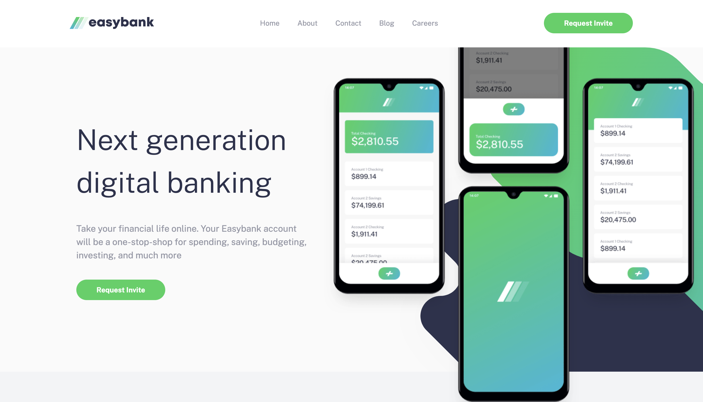

# Frontend Mentor - Easybank landing page solution

This is a solution to the [Easybank landing page challenge on Frontend Mentor](https://www.frontendmentor.io/challenges/easybank-landing-page-WaUhkoDN). Frontend Mentor challenges help you improve your coding skills by building realistic projects. 

## Table of contents

- [Overview](#overview)
  - [The challenge](#the-challenge)
  - [Screenshot](#screenshot)
  - [Links](#links)
- [My process](#my-process)
  - [Built with](#built-with)
  - [Useful resources](#useful-resources)
- [Author](#author)

## Overview

### The challenge

Users should be able to:

- View the optimal layout for the site depending on their device's screen size
- See hover states for all interactive elements on the page

### Screenshot

### Links

- Solution URL: [https://github.com/Khemmie-Ray/Easybank-landing-page.git](https://github.com/Khemmie-Ray/Easybank-landing-page.git)
- Live Site URL: [https://easy1-bank-landing-page.netlify.app/](https://easy1-bank-landing-page.netlify.app/)

## My process

### Built with

- Semantic HTML5 markup
- TailwindCSS
- Flexbox
- Mobile-first workflow

### Useful resources

- [TailwindCSS docs](https://tailwindcss.com/) - This helped me to better understand the utility classes in TailwindCSS. 

## Author

- Frontend Mentor - [@Khemmie-Ray](https://www.frontendmentor.io/profile/Khemmie-Ray)
- Twitter - [@haramide](https://www.twitter.com/haramide)